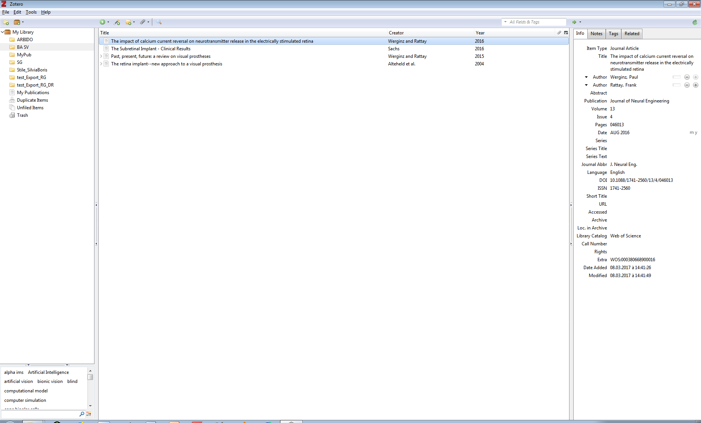

## Zotero Library

Your Zotero library will contain all the references you add into your library. You can create subsets of your library by adding "collections".

## Collecting references

A reference consists of metadata describing a document and allowing you to easily find the document later. Zotero structures the metadata you collect about documents. When you cite your documents with Zotero, it will then generate consistent bibliographies. Zotero also allows you to store digital files along with the references.

The best is to collect references while you are in the process of looking for information. By that, we mean that you will be more efficient if you directly collect the metadata while you are on the website / database / library catalog where you find your documents because you won't need to find the reference a second time afterwards.

### ... with Zotero Connector

The Zotero Connector is the plugin that you installed in your browser. This plugin will detect the references available on the page you are visiting. The quality of the metadata depends on the sources you visit.   
Open Zotero and click on the Zotero connector icon in your browser : the reference will be automatically sent to your Zotero library.

Example : an article from [Cytology](https://doi.org/10.1007/s00004-009-0012-x)

### ... using RIS or BibTeX 

Some databases or catalogs can provide you with a downloadable file containing one or more references. The most common formats for these kind of files are RIS (.ris) or BibTeX (.bib). It is most useful for large scale exports. 

Example : here is a [sample file to download](https://github.com/epfllibrary/zotero-course/blob/master/docs/references.zip)

### ... with a unique identifier (DOI, PMID, ISBN). 

Documents are often attributed a unique identifier: this helps when you have a copy of this document and you want to add the reference to Zotero. 

In Zotero, if you click on the magic wand icon in the top bar, a field appears. Type the identifier of the document. Press enter. A new reference will be added to your library.

Example : the ISBN of a book, DOI of a scientific paper or the PMID of a biomedical paper. 

### ... from a PDF

If you have stored PDFs on your computer without directly adding them in Zotero with their metadata, it's often possible to obtain comprehensive metadata afterwards. 

You need to add the PDF in Zotero, by dragging it from a folder and dropping it in your library. Zotero automatically searches for metadata and automatically create a reference containing the metadata along with the PDF file when possible. However, it might be that the PDF you added to your Zotero library is not machine-readable or is not recognized by Zotero. In that case, no metadata will be retrieved. You can also retrieve metadata for several PDFs at the same time.

Example : a PDF sent by a colleague

### ... manually

Sometimes, there is no available metadata encoded in the page you are visiting or the document you have in your hands is not indexed in a digital catalog. You will need to create or edit the reference yourself.   

In Zotero, you can create a new item by clicking on *File > New Item* or on the green circle with a plus. Either way, you will need to choose the type of document you want to create a reference for (ie "Book", "Report", etc.). When you select the type of document, a blank reference appears. You can then fill the fields according to the document you have in front of you. In all cases, it is best to be exhaustive as possible and to give as much information as possible. 

Example : a report from the [Swiss Federal Statistical Office](https://www.bfs.admin.ch/bfs/en/home/statistics/catalogues-databases/publications.assetdetail.3862240.html)

### Retrieve PDFs 

In some cases, you might want to store a copy of the full text associated with the bibliographic reference. It is possible to retrieve and add full text PDFs in two ways. 
1. While adding a bibliographic reference from the browser.
2. Later on, doing a right-click on a reference (or a batch of references) and clicking on "Find available PDF"
